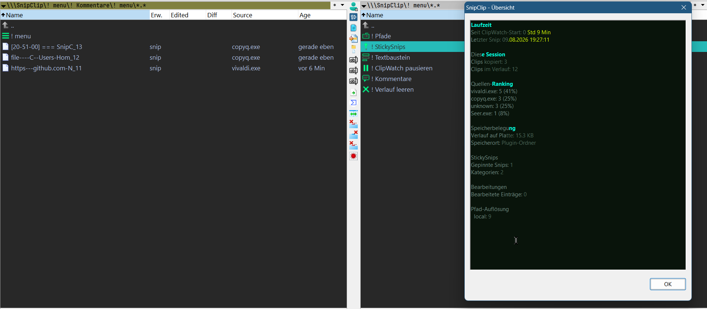

# SnipClip

A Total Commander plugin that turns your clipboard into a searchable, persistent directory. No separate tool, no tray icon, no window of its own sitting around – SnipClip lives entirely inside TC, as a virtual panel under `\SnipClip`.



*[Deutsche Version](README.md) · [Русская версия](README.ru.md)*

## Chapters
- [What it can](#what-it-can)
- [Specific](#specific)
- [Architecture, briefly](#architecture-briefly)
- [Installation](#installation)
- [Build](#build)
- [License](#license)

## What it can

You copy as usual – Ctrl+C, from any program. SnipClip picks that up in the background (ClipWatch, an invisible window registered with Windows for clipboard changes, no polling) and drops the text into the `\SnipClip` panel as a virtual file.

**Passwords stay out.** When an app deliberately copies something it doesn't want tracked – Bitwarden, KeePassXC, 1Password, Chrome incognito – it marks that with an official Windows signal. SnipClip honors it and leaves those copies completely untouched. Honest caveat: this is a voluntary request, not an enforced block – some sources simply don't set the signal. Anyone who wants to capture everything anyway for their own testing can turn that off.

**The history is fundamentally immutable** – but not entirely without an escape hatch anymore. Originally, only "! Verlauf leeren" (clear everything at once) could ever remove anything. Now, if something wrong ends up in there, a single entry can also be deleted – guarded by its own extra confirmation on top of TC's normal delete prompt. Anyone who prefers the original strict rule can turn this back off.

**Editing works, just not on the original.** F3 opens a snip in SnipClip's own Lister plugin. Ctrl+E switches to edit mode (the background turns light), you correct it, Ctrl+S writes straight back to the clipboard. The history row itself stays unchanged, you just see noted whether and how much it was last edited.

**What matters to you, you pin.** F5 or drag & drop into a category under `! StickySnips` – create categories with F7. Pinned snips survive even once the rest of the history has long rotated out.

**Merge several fragments into one**, before you use them – code fragments or text pieces you copy one after another into the same typed name under `! Textbaustein\Entwurf` get appended there instead of replaced. Done collecting? Renaming out of `Entwurf\` via F6 secures the result for good. Details on why appending only works one at a time: see the [Textbaustein note](notes/textbaustein/textbaustein.en.html).

**Copy a file instead of text**, and SnipClip ignores it by default. Turn on path resolution and the file path gets captured as text instead, collected under `! Pfade`, completely separate from the main history.

**Screenshots land under `! Screenshots`** – but only from programs you explicitly allow (`[image_capture_sources]` in the ini, whitelist-based, same principle as path resolution). If e.g. FastStone Capture puts an image on the clipboard after closing its capture window, it gets saved automatically as a `.bmp`. Two independent storage limits (`max_screenshots`, `max_total_size_mb`) keep the collection from growing unchecked – whichever hits first trims the oldest screenshot.

**Screenshots can be pinned too** – either standalone (like text: F5/drag & drop from `! Screenshots` into a normal StickySnips category) or linked to an existing note by having both land in the same subfolder. Linked entries show their own column ("Verknuepft") in `! Screenshots` with the linked note's name. Deleting either side of a link only dissolves the link itself – the other element stays fully intact. Opening a linked note with F3 shows text and image combined in the Lister – text on top, the image scaled down below preserving its aspect ratio, click it to open full size. Read-only: Ctrl+E falls back to plain text for editing. Details and why it's built this way: see the [linking note](notes/screenshot-linking/screenshot-linking.en.html).

**Every entry automatically shows its source app's icon** in front of the name (extracted from the actual `.exe`) – linked entries get their own chain-link symbol instead. If the source is unknown or that `.exe` is gone, a fallback icon kicks in (built-in, or your own `.ico` via `FallbackSourceIcon=`).

**New clips appear live**, no manual Ctrl+R needed – once you've interacted with the panel once (e.g. Alt+Enter), the view refreshes automatically after every new capture.

Alt+Enter on a single entry shows source, category (for pinned snips), timestamp (absolute and relative), edit status, and the full content. Alt+Enter on one of the special rows shows an overview instead – runtime, session stats, source ranking, StickySnips counts, edit statistics, actual disk usage.

**From that same Alt+Enter dialog, the selected entry can also be uploaded directly** – screenshots to ImgBB, text (history, StickySnips, Textbausteine) to Pastebin. Off by default, the button only appears once you've set up both services; the returned URL is written straight to the clipboard. Step-by-step setup: see the [cloud upload note](notes/cloud-upload/cloud-upload.en.html).

## Specific

### The panel structure: `! menu`

All command rows (`! ClipWatch pausieren`, `! Verlauf leeren`, `! StickySnips`, `! Pfade`, `! Textbaustein`, `! Kommentare`, `! Screenshots`) live tucked under a single row by default: `! menu`. Keeps the root uncluttered – only your actual clips sit there directly visible.

```ini
[menu]
RootButtons=
```

If you'd rather have certain commands directly at root (e.g. because you click into StickySnips often), list their keys comma-separated: `RootButtons=Sticky,Path`. Available keys: `Pause`, `Clear`, `Sticky`, `Path`, `Textbaustein`, `Comments`.

Each special row has its own small icon (instead of TC's default file/folder symbol) – makes them easier to tell apart at a glance, especially when several sit next to each other in `! menu`.

### `[history]` – history basics

- **`max_entries`** (default 100) – max entries at once, oldest gets dropped automatically
- **`name_preview_length`** (default 20) – characters used for the panel name
- **`persist_history`** (default 1) – survives a TC restart or not
- **`dedup_consecutive`** (default 1) – two identical copies in a row create only one entry
- **`AllowSingleDelete`** (default 1) – whether individual entries can be deleted at all

### `[Theme]` – look

Its own "Basic" theme ("Alien Blood") as a recognition trait. For consistency with other plugins: `Name=gruvbox|everforest|solarized`, each with `Mode=dark|light`. `NoColors=1` under `[Settings]` disables any theme entirely.

**`FontBrightness=`/`BackgroundBrightness=`** (each -3 to +3, default 0) – fine-tune brightness through fixed, curated steps. Why exactly seven steps, and why font/background respond by different amounts: see the [brightness note](notes/basic-theme/basic-theme.en.html). If a combination ends up too low-contrast, a safe fallback kicks in automatically, with a warning line in the Alt+Enter window.

**`TimeBasedMode=`** (default 0) – when set, the current hour decides light/dark instead of `Mode=` (`LightStartHour=`/`DarkStartHour=`, default 6-18 light). Takes effect live, no restart needed. Only affects the main dialogs (Properties/Overview) - the Lister and the Textbaustein comment mask have their own independent Ctrl+E light/dark switch, unaffected by this.

### `[lister]` – the editor

Deliberately uses a different theme than the rest of the plugin (dark to read, light to edit): `gruvbox`, `everforest`, or `solarized`. Why saving here works without TC's upload error: see the [AutoReUpload note](notes/autoreupload/autoreupload.en.html).

**`MonoFont=`/`MonoFontName=`** – your own monospace font instead of Consolas. Already pre-configured for JetBrains Mono (bundled in the `fonts\` folder, SIL Open Font License).

### `[sticky]` – the second, curated list

**`default_category`** (default "Unsortiert") – kicks in when you drag straight onto `! StickySnips` itself instead of a category.

### `[textbaustein]` – merging fragments

Restructured: appending only works inside `! Textbaustein\Entwurf\` now – the root of `! Textbaustein` itself is "secured", nothing gets auto-added there anymore. Finish collecting, then rename out of `Entwurf\` via **F6** (e.g. `Entwurf\y` → `config-final`) – changing folder and setting the final name happen in one step, through TC's own rename dialog.

**`separator_blank_lines`** (default 1) – how many blank lines sit between appended pieces.

**`highlight_last_append`** (default 1) – opening a Textbaustein with F3 automatically selects the most recently appended piece (plain Windows text selection, disappears on the first click).

**Comments**: StickySnips and Textbausteine can carry a short recognition note (handy for short names like "y" or "z"). Alt+Enter shows the comment, the "edit" button at the bottom-left opens a small separate mask with **Ctrl+E**/**Ctrl+S** – same convention as the Lister. `! Kommentare` lists every comment set so far at a glance, stacked. Details, and why this is its own solution rather than DescriptEdit directly: see the [comments note](notes/comments/comments.en.html).

### `[path_resolve]` – file paths instead of text

Off by default. Once enabled, SnipClip converts file copies to text:

| Format | Example |
|---|---|
| `local` | `C:\Users\Name\File.txt` |
| `forwardslash` | `C:/Users/Name/File.txt` |
| `unc` | `\\server\share\File.txt` |
| `fileuri` | `file:///C:/Users/Name/File.txt` |
| `wsl` | `/mnt/c/Users/Name/File.txt` |

`AllowExtensions`/`AllowFolders` restrict this via a semicolon-separated list.

### `[Settings]` – misc

- **`RespectClipboardExclude`** (default 1) – honor the password-manager signal
- **`StartPaused`** (default 0) – ClipWatch starts active or deliberately inactive
- **`LiveRefreshAfterCapture`** (default 1) – panel refreshes automatically after a new capture

### Custom columns
Five extra columns via TC's column configuration: **Edited**, **Diff**, **Source**, **Age**, **Verknuepft** (only populated for screenshots, shows the name of a linked note).

### `[cloud_upload]` – ImgBB & Pastebin

Off by default (`Enabled=0`) – nothing leaves this PC until both the master switch **and** the relevant service's key are set. Two separate services, each with its own API key: `[cloud_upload_imgbb]` for screenshots, `[cloud_upload_pastebin]` for text. Pastebin additionally needs a one-time login step for the user key (doesn't expire per Pastebin's own docs). Step-by-step guide including the PowerShell command: see the [cloud upload note](notes/cloud-upload/cloud-upload.en.html).

## Architecture, briefly

Two separate DLLs in the same TC process: `SnipClip.wfx`/`.wfx64` (panel, history, StickySnips, Textbaustein, ClipWatch) and `SnipClipLister.wlx`/`.wlx64` (just the Ctrl+E editor). Why both use the `TC_SnipClip_` window/message prefix: see the [window class naming note](notes/window-class-naming/window-class-naming.en.html).

## Installation

**WFX:** Configuration → Options → Plugins → File System Plugins → Configure → Add, select `SnipClip.wfx64`.

**WLX:** Configuration → Options → Plugins → Lister Plugins → Configure → Add, select `SnipClipLister.wlx64`, then manually assign it to the `snip` extension.

**Recommended:** set `AutoReUpload=2` in `wincmd.ini` – see the [AutoReUpload note](notes/autoreupload/autoreupload.en.html).

## Build

MinGW-w64 (64-bit under `C:\mingw64`, optionally 32-bit under `C:\mingw64\mingw32`). Run `build_debug.bat`, binaries land in `release\`.

## License

MIT.
